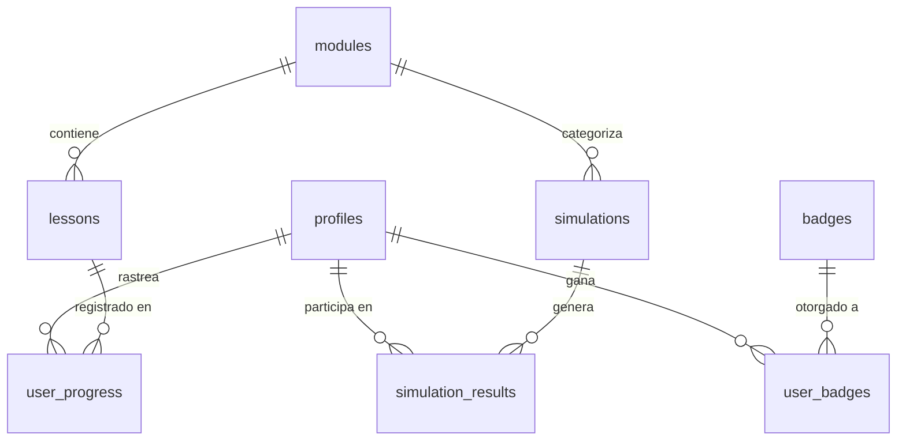

HPE# Semilla - Documentación del Esquema de Base de Datos

Este documento proporciona una visión detallada de la base de datos PostgreSQL alojada en Supabase para el proyecto **Semilla**.

## Resumen del Proyecto
- **Nombre del Proyecto**: Semilla
- **ID del Proyecto**: `wnvdjhwceywfbcwvkrla`
- **Región**: `us-west-2`
- **Esquema Principal**: `public`

## Procesos de Autenticación

Semilla utiliza **Supabase Auth** para gestionar el acceso de los usuarios de forma segura.

### Registro (Sign-up)
1. **Interfaz**: El usuario ingresa su nombre, correo y contraseña en `Signup.tsx`.
2. **Validación**: Se aplican reglas de complejidad de contraseña (min 8 caracteres, mayúscula, número).
3. **Llamada API**: Se utiliza `supabase.auth.signUp` a través del `AuthContext`.
4. **Metadatos**: El nombre completo se guarda en los metadatos del usuario (`data.full_name`).
5. **Vínculo con Perfiles**: Existe una tabla `public.profiles` cuyo `id` es una llave foránea que apunta a `auth.users.id`. Al registrarse, se crea automáticamente un perfil asociado con estadísticas de gamificación iniciales (XP 0, Nivel 1).

### Inicio de Sesión (Login)
1. **Interfaz**: `Login.tsx` solicita credenciales.
2. **Método**: Se utiliza `supabase.auth.signInWithPassword`.
3. **Persistencia**: Supabase gestiona la sesión mediante un JWT (JSON Web Token) almacenado localmente, permitiendo que el estado de autenticación persista entre recargas de página.

---

## Esquema de Relación de Entidades (ERD)

La base de datos está diseñada para soportar una plataforma de aprendizaje gamificada.

---

## Detalles de las Tablas

### `profiles` (Perfiles)
Almacena metadatos del usuario y estadísticas de gamificación.

| Columna | Tipo | Descripción |
| :--- | :--- | :--- |
| `id` | uuid | Llave Primaria (vinculada a `auth.users.id`) |
| `email` | text | Correo electrónico del usuario |
| `full_name` | text | Nombre completo para mostrar |
| `role` | text | Rol: `student` (estudiante), `admin`, `instructor` |
| `xp` | integer | Puntos de experiencia acumulados |
| `level` | integer | Nivel actual del usuario |
| `streak_days`| integer | Días de racha activa |
| `last_active_at` | timestamptz | Última actividad registrada |

---

### `modules` (Módulos)
Categorías principales de aprendizaje (ej. "Ahorro", "Inversión").

| Columna | Tipo | Descripción |
| :--- | :--- | :--- |
| `id` | uuid | Llave Primaria |
| `title` | text | Título del módulo |
| `slug` | text | Identificador único para URLs |
| `icon` | text | Icono o emoji representativo |
| `color` | text | Color distintivo del tema |
| `is_published`| boolean | Estado de publicación |

---

### `lessons` (Lecciones)
Contenido individual dentro de un módulo.

| Columna | Tipo | Descripción |
| :--- | :--- | :--- |
| `id` | uuid | Llave Primaria |
| `module_id` | uuid | Llave Foránea a `modules.id` |
| `title` | text | Título de la lección |
| `content_type`| text | Tipo: `article`, `video`, `quiz`, `simulation` |
| `xp_reward` | integer | XP otorgada al completar |

---

### `user_progress` (Progreso de Usuario)
Rastrea el estado de finalización de las lecciones.

| Columna | Tipo | Descripción |
| :--- | :--- | :--- |
| `user_id` | uuid | Llave Foránea a `profiles.id` |
| `lesson_id` | uuid | Llave Foránea a `lessons.id` |
| `status` | text | Estado: `not_started`, `in_progress`, `completed` |

---

### `simulations` & `simulation_results`
Aprendizaje interactivo basado en escenarios.

- **`simulations`**: Define el escenario, dificultad (`beginner`, `intermediate`, `advanced`) y datos de la ruta interactiva.
- **`simulation_results`**: Registra el desempeño del usuario, puntaje obtenido y decisiones tomadas.

---

## Seguridad y Control de Acceso (RLS)

Todas las tablas en el esquema `public` tienen activado **Row Level Security (RLS)**.
- **Perfiles**: Solo el usuario autenticado dueño de la fila puede leer/escribir.
- **Contenido**: Lectura pública para usuarios autenticados; escritura restringida a administradores.
- **Progreso/Resultados**: El acceso está filtrado para que cada usuario solo vea sus propios registros.

## Historial de Migraciones
1. `create_profiles_table`: Estructura base de usuarios.
2. `create_modules_and_lessons`: Estructura de contenido educativo.
3. `create_user_progress`: Sistema de rastreo de aprendizaje.
4. `create_simulations`: Integración de escenarios dinámicos.
5. `fix_function_search_path`: Optimización de seguridad en funciones.
